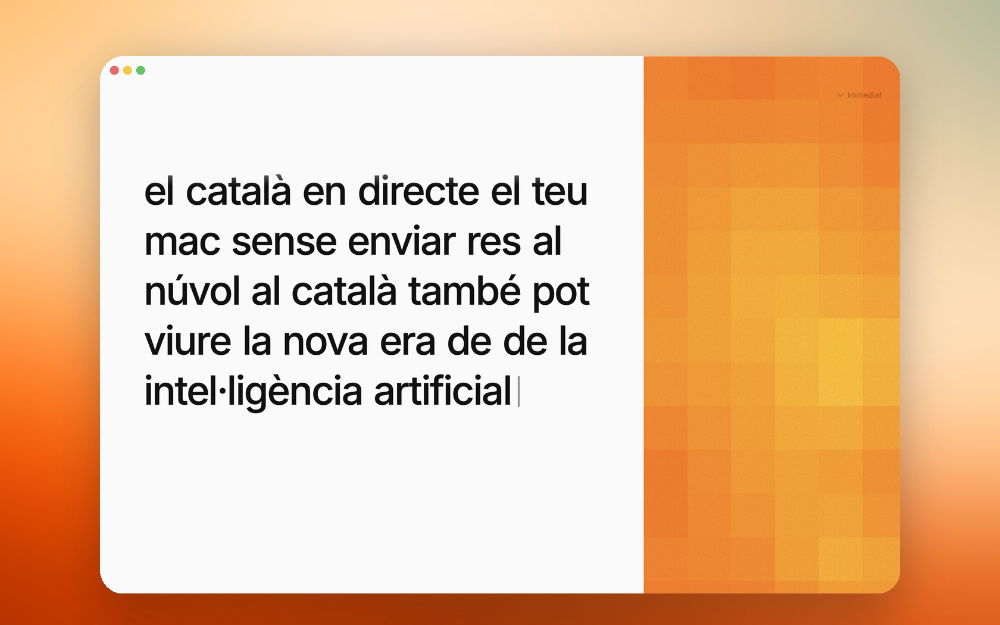

<div align="center">



# Subtítol Live

**Subtítols en català, en directe, al teu Mac. Sense núvol.**

[](#requisits)
[](LICENSE)
[](docs/EL-MODEL.md)

</div>

---

Subtítol Live escolta català pel micròfon i el converteix en text llegible mentre passa.
Tot el processament és local: el model viu dins l'app i la veu no surt mai de l'ordinador.

No és un bolcat brut de reconeixement de veu. És un **editor en directe**: el model proposa,
l'app decideix què és prou estable perquè el lector el llegeixi. Les paraules que ja has llegit
no es mouen; com a molt, les tres últimes encara poden canviar.

Aquest projecte és una **prova del potencial del català en la nova era de productes amb IA**:
el cervell el va entrenar el Barcelona Supercomputing Center (Projecte Aina, MareNostrum 5)
i el producte demostra que es pot convertir en una experiència real, privada i ben dissenyada.

## Descarrega i prova (2 minuts)

Requisits: **macOS 14 o superior, Apple Silicon** i un micròfon.

1. Baixa **`Subtitol-Live.dmg`** de l'[últim release](../../releases/latest) (~1,1 GB, el model ja va inclòs).
2. Arrossega **Subtítol Live** a Aplicacions.
3. La primera vegada, macOS avisarà que l'app no està notaritzada (va signada ad-hoc).
   Obre-la amb **clic dret → Obrir**, o executa:

   ```sh
   xattr -dr com.apple.quarantine "/Applications/Subtítol Live.app"
   ```

4. Dóna permís de micròfon, prem **espai** o fes clic, i parla en català.

## Compila des de la font

```sh
git clone https://github.com/uriocallaghan/subtitols-catala-en-directe.git
cd subtitols-catala-en-directe

# 1. Baixa el model (~1,1 GB, verificat per SHA256)
./scripts/download-model.sh

# 2. Executa des de SwiftPM (el runtime ja ve vendorat a SubtitolLive/Vendor)
cd SubtitolLive
SUBTITOL_MODEL="$PWD/../models/catalan-parakeet-q8.gguf" swift run -c release SubtitolLive

# …o genera i instal·la el .app a /Applications
./scripts/build-app.sh
```

Tests:

```sh
xcrun swift run -c debug SubtitolLiveTests
```

## Com funciona

```
veu → cinta de 6 s → presa de 4 s → Parakeet català al Mac (Metal)
                                        ↓
                              esborrany de paraules
                                        ↓
                   editor: bloqueja el que és estable,
                   deixa ≤3 paraules vives a la cua
                                        ↓
                  paper (roll-up)  |  camp decoratiu
```

Tres perfils de lectura — **Fiable / Equilibrat / Immediat** — regulen la calma contra la
rapidesa. Documentació completa:

- [Com funciona](docs/COM-FUNCIONA.md) — el producte explicat sense codi.
- [El model i la tecnologia](docs/EL-MODEL.md) — NVIDIA → BSC/Aina → GGUF al Mac.
- [Verificació de latència](docs/LATENCY.md) — harness de mesura i objectius.
- [Fiabilitat i diagnòstic](docs/RELIABILITY.md) — captures de sessió opt-in.

## Tecnologia

| Capa | Què és |
|---|---|
| App | SwiftUI · macOS 14+ · arquitectura modular (`SubtitolCore`, `SubtitolEngine`) |
| Model | Parakeet RNNT 1.1B → fine-tune català del BSC → GGUF Q8 (~1,1 GB) |
| Runtime | NeMo-Speech.cpp (NVIDIA) + ggml amb Metal — vendorat a `SubtitolLive/Vendor` |
| Privacitat | Zero xarxa. L'àudio viu en un buffer de 6 s en memòria i no es desa |

## Limitacions conegudes

- Sense detecció de veu (VAD): el producte decideix deliberadament no tallar silencis encara.
- El checkpoint exacte del BSC (pkt-a / pkt-b) no està identificat al manifest — documentat a
  [EL-MODEL.md](docs/EL-MODEL.md).
- L'app es distribueix signada ad-hoc, sense notarització d'Apple.

## Crèdits i llicència

Codi sota **MIT** © Uri O'Callaghan. El model i el runtime tenen llicències pròpies
(BSC-LT Apache-2.0, Parakeet CC-BY-4.0, Inter OFL) — atribucions completes a
[NOTICE.md](NOTICE.md).
